# PHIVOLCS Earthquake Data Pipeline 🌏

**Production-Grade ETL System**: Automated data pipeline processing 100k+ earthquake records from PHIVOLCS (Philippine Institute of Volcanology and Seismology) with real-time ingestion, intelligent deduplication, and interactive web visualization.

### Live Demo
🌐 **Live System**: https://thu-united-housing-guild.trycloudflare.com/

> **Note**: This demo runs on a Raspberry Pi with Cloudflare Tunnel (free tier). The URL may change periodically due to tunnel restarts or Pi maintenance. For stable access, please run locally.

### Main User Interface


*Interactive earthquake monitoring dashboard with real-time filtering and map visualization*

## Data Engineering Overview

**Pipeline Architecture**: End-to-end ETL system handling heterogeneous data formats across multiple years with automated schema evolution and business key-based upsert logic.

**Data Volume**: 103,596+ earthquake records spanning 2018-2025  
**Processing Rate**: ~1,500 records per daily batch  
**Data Quality**: 99.9% successful ingestion with comprehensive validation  
**Latency**: Real-time updates within 8-hour cycles  

## Problem Statement

**Challenge**: PHIVOLCS earthquake data exists in inconsistent HTML formats across different time periods, requiring robust extraction strategies and intelligent data harmonization for analytical workflows.

**Solution**: Multi-stage ETL pipeline with format-aware scrapers, fallback parsing strategies, and production-grade database architecture optimized for geospatial and temporal queries.

## System Architecture

### ETL Pipeline (Draw.io Style)

```mermaid
flowchart LR
    subgraph EXTRACT[" 🌐 EXTRACT LAYER "]
        A[🌍 PHIVOLCS Website]
        B[🔄 Historical Scraper<br/>2018-2019]
        C[🔄 Modern Scraper<br/>2020-2025]
        D[🔄 Daily Scraper<br/>Live Updates]
    end
    
    subgraph TRANSFORM[" ⚙️ TRANSFORM LAYER "]
        E[📄 HTML Parser<br/>BeautifulSoup]
        F[🧹 Data Cleaner<br/>Validation & Formatting]
        G[🔑 Business Key Generator<br/>YYYY_MMDD_HRMM_PROVINCE]
        H[🔍 Duplicate Detector<br/>Version Comparison]
    end
    
    subgraph LOAD[" 💾 LOAD LAYER "]
        I[⚡ Upsert Engine<br/>INSERT/UPDATE/SKIP]
        J[(🗄️ PostgreSQL<br/>Database)]
        K[(📊 seismic_event<br/>Table)]
        L[(📈 intensities<br/>Table)]
    end
    
    A --> B
    A --> C
    A --> D
    
    B --> E
    C --> E
    D --> E
    
    E --> F
    F --> G
    G --> H
    
    H --> I
    I --> J
    J --> K
    J --> L
    
    style EXTRACT fill:#e3f2fd,stroke:#1976d2,stroke-width:2px
    style TRANSFORM fill:#f3e5f5,stroke:#7b1fa2,stroke-width:2px
    style LOAD fill:#e8f5e8,stroke:#388e3c,stroke-width:2px
    
    style A fill:#bbdefb
    style J fill:#c8e6c9
```


### Docker Containerized Deployment

```mermaid
flowchart LR
    subgraph EXTERNAL[" 🌍 EXTERNAL SERVICES "]
        A[👥 Users<br/>Web Browser]
        B[🌍 PHIVOLCS Website<br/>earthquake.phivolcs.dost.gov.ph]
        C[🔧 Environment Config<br/>.env File]
    end
    
    subgraph DOCKER[" 🐳 DOCKER COMPOSE STACK "]
        subgraph WEB[" 📦 phivolcs_web "]
            D[🐍 Flask Web Server<br/>Port 5000]
            E[⚙️ Admin Dashboard<br/>Token Authentication]
            F[🔒 Health Check<br/>curl /health]
        end
        
        subgraph DATABASE[" 📦 phivolcs_db "]
            G[(🐘 PostgreSQL 15 Alpine<br/>Port 5432)]
            H[🔍 Health Check<br/>pg_isready]
        end
        
        subgraph SCRAPERS[" 📦 phivolcs_scraper "]
            I[🔄 Manual Scraper<br/>Profile: scraper]
            J[⏰ Scheduled Scraper<br/>Profile: scheduler<br/>Every 8 hours]
        end
        
        subgraph STORAGE[" 💾 DOCKER VOLUMES "]
            K[📂 postgres_data<br/>Database Persistence]
            L[📂 logs<br/>Application Logs]
            M[📂 static<br/>CSS/JS Assets]
            N[📂 templates<br/>HTML Templates]
        end
    end
    
    A --> D
    B --> I
    B --> J
    C --> WEB
    C --> DATABASE
    C --> SCRAPERS
    
    D --> G
    I --> G
    J --> G
    
    G --> K
    D --> L
    I --> L
    J --> L
    D --> M
    D --> N
    
    style EXTERNAL fill:#ffebee,stroke:#c62828,stroke-width:2px
    style DOCKER fill:#f0f8ff,stroke:#0084ff,stroke-width:3px,stroke-dasharray: 5 5
    style WEB fill:#e3f2fd,stroke:#1976d2,stroke-width:2px
    style DATABASE fill:#e8f5e8,stroke:#388e3c,stroke-width:2px
    style SCRAPERS fill:#f3e5f5,stroke:#7b1fa2,stroke-width:2px
    style STORAGE fill:#fff3e0,stroke:#f57c00,stroke-width:2px
    
    style A fill:#ffcdd2
    style G fill:#c8e6c9
    style D fill:#bbdefb
```


## Technology Stack

**Backend**: Python 3.11+, Flask, SQLAlchemy, PostgreSQL, BeautifulSoup4  
**Frontend**: Leaflet.js, HTML5/CSS3, Vanilla JavaScript  
**DevOps**: Docker, Docker Compose, UV Package Manager  
**Tools**: Requests, lxml, Python Logging, Environment Variables

## ETL Pipeline Details

### Extract
- Multi-format scrapers for different time periods (2018-2019 legacy vs 2020+ structured)
- Fault-tolerant extraction with retry logic and rate limiting

### Transform  
- **Business Key Generation**: Creates unique composite keys (YYYY_MMDD_HRMM_PROVINCE) for intelligent deduplication
- Schema normalization and data quality validation with geospatial processing

### Load
- **Intelligent Upserts**: Version-aware INSERT/UPDATE/SKIP logic using business key comparison
- **Transaction Safety**: SQLAlchemy session management with proper connection handling
- Performance optimization with bulk operations and composite indexing

## Quick Start

### Local Development
```bash
# Clone and setup
git clone https://github.com/your-username/phivolcs-etl-backend.git
cd phivolcs-etl-backend
cp .env.example .env

# Deploy with Docker
docker-compose up -d --build

# Load sample data (optional - for full demo experience)
docker exec phivolcs_db psql -U $DB_USERNAME -d $DB_NAME -f /app/database/sample_data.sql

# Access: http://localhost:5000
```

### Sample Data Options

The repository includes sample earthquake data for immediate testing:

- **`database/schema.sql`** - Database structure only
- **`database/quick_demo.sql`** - 1 month of recent data (~500-1000 records)
- **`database/sample_data.sql`** - 3 months of recent data (~3000-5000 records)

```bash
# Quick demo (minimal data)
docker exec phivolcs_db psql -U $DB_USERNAME -d $DB_NAME -f /app/database/quick_demo.sql

# Full sample (recommended for portfolio demonstration)
docker exec phivolcs_db psql -U $DB_USERNAME -d $DB_NAME -f /app/database/sample_data.sql
```

> **Note**: Without sample data, local setup only shows current month earthquakes from daily scraper. Sample data provides the full historical context showcased in the live demo.

## Database Schema

```sql
seismic_event: Main earthquake table with geospatial indexing
intensities: Related intensity measurements table
Indexes: Optimized for date/location/magnitude queries
```

## Background

As my first data engineering project, I wanted to learn DE fundamentals hands-on while tackling a genuinely useful problem. During my internship at PHIVOLCS (where I trained seismic wave identification), I was inspired by the QuakeFlow pipeline and saw an opportunity to apply data engineering principles to earthquake data - which is both technically challenging and serves public safety.

## Acknowledgments

Data provided by PHIVOLCS (Philippine Institute of Volcanology and Seismology). Built during internship while learning seismic wave analysis.

## Disclaimer

Educational project demonstrating data engineering skills. Not affiliated with PHIVOLCS official systems.

## License

Educational and research purposes. Please respect PHIVOLCS data usage policies.